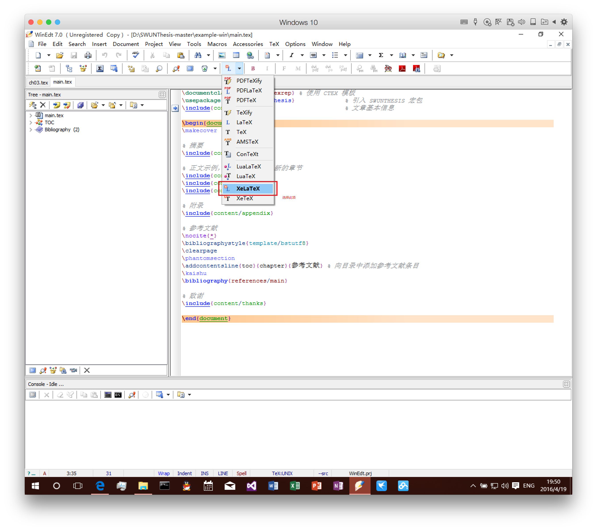
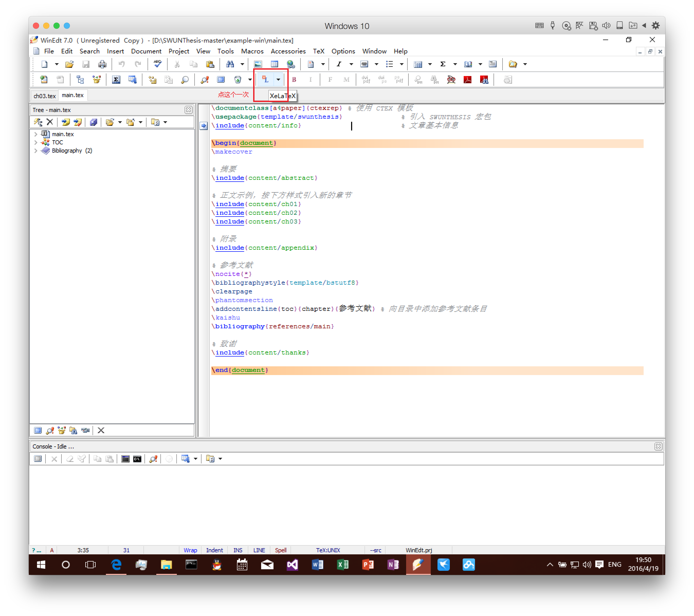
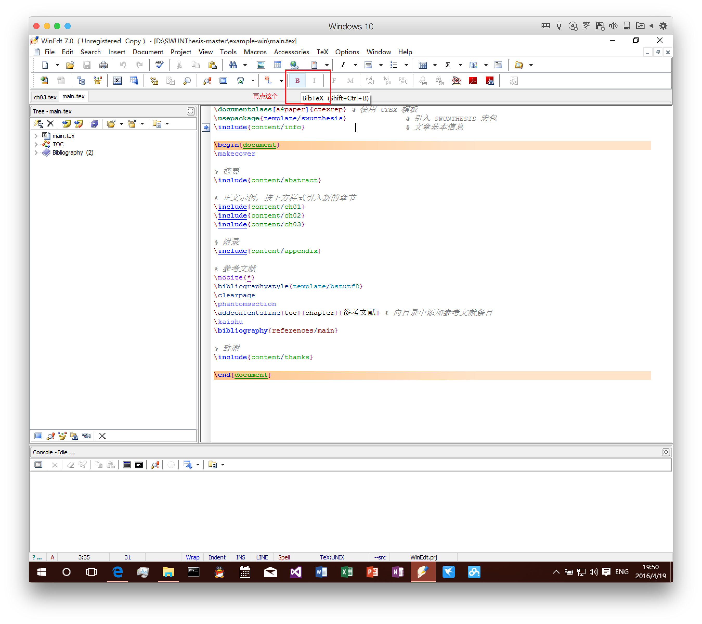
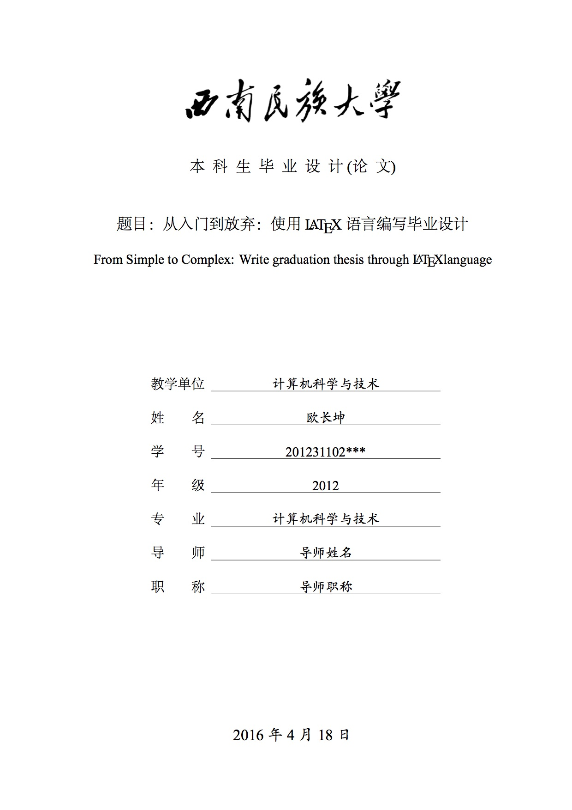
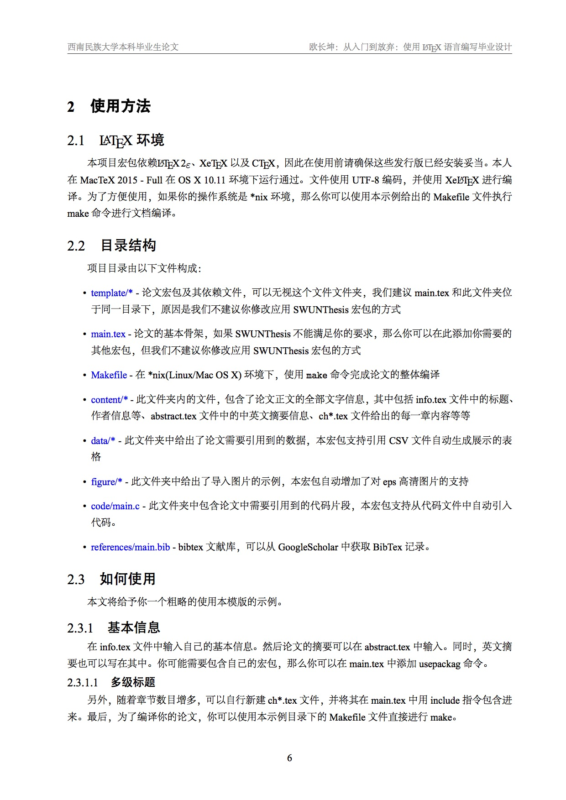

# SWUNThesis 是什么？
SWUNThesis 为 **S**outh**W**est **U**niversity for **N**ationalities **Thesis** LaTeX Template 之缩写。

本宏包旨在建立一个简单易用的西南民族大学学位论文模板，当前仅支持本科学士论文，对其他格式（如科技论文、报告、硕士学位论文等）的支持会陆续加入（可能？）。

使用过程中若遇到任何问题，请按以下顺序提交问题：

1. **[GitHub Issuse](https://github.com/changkun/SWUNThesis/issues)**
2. **[hi[at]changkun.us](mailto:hi@changkun.us)**。

使用宏包的关键语句为：

```latex
\usepackage{template/swunthesis} 
```

文章的整体框架如下，使用示例请参考 [example](./example) 文件夹下的示范。将 template 文件夹、Makefile 与 main.tex 放置于同一目录下，并将正文内容分章节放置于 `content` 目录下即可使用，下方有具体的安装和使用教程。

## 目录说明

* [template](./template) - 此目录下为宏包的全部依赖文件
* [images](./image) - 此目录下为本项目的图片说明
* [example](./example) - 此目录下展示了一个完整的论文示例
* [example-win](./example-win) - 此目录下展示了一个 Windows 平台下的完整的论文示例
* [README.md](./README.md) - 项目说明
* [LICENCE](./LICENSE) - 项目使用许可

## 安装、使用教程

### 前置安装

* Windows 用户请安装 [CTeX 完整版](http://www.ctex.org/CTeXDownload)(约1.3G, 推荐) 或 [TeXLive for Windows](https://www.tug.org/texlive/windows.html)

> CTeX WinEdt 编译问题解决方案
> 
> **Windows 用户注意**：CTEX 版本需要 2.0.2 以上，版本查看方式请在命令行中输入 `texdoc ctex` 。

> * 缺少 qtcore4.dll：[解决方案](https://www.baidu.com/link?url=xaETqZBcpIT6acrKVdN9g5iMWJ3WzBnipIK0JMvyVGYHWenKtpmk5Nw-bGdQRzHfnd2fnhDNFi4t4dCL3Yo2-8yY6Kf1zQtVUgwb2iVXnZS&wd=&eqid=f49127ba0004396b000000035716062d)
> * 请使用 `xelatex` 编译时提示缺少 `amsmath`，请使用 CTeX 自带的 Package Manager 安装此宏包
> * 若各种提示 `undefine control sequence` 则请在线更新 `ctex`, `l3kernel`, `l3packages`, `xeCJK`, `csvsimple` 包，将所有宏包更新最佳。

* Linux Ubuntu 用户请使用 TeXLive，在终端中使用： 

```bash
sudo apt-get install texlive-full
```

即可完成安装。

* Mac 用户请下载 [MacTex](https://www.tug.org/mactex/) 安装包进行安装

### 文档编译方法

**Windwos 用户**：

* CTeX WinEdt 用户先使用 `xelatex` 编译一次 `main.tex` 文件、再使用 `bibtex` 编译一次 `main.tex`、最后再使用 `xelatex` 编译两次 `main.tex` 即完成 `main.pdf` 的全部编译，如下图所示






* TeXLive 用户可以使用 `latexmk` 并添加 `-xelatex` 参数一次完成对 `main.tex` 的编译。

**Linux(Ubuntu)/Mac 用户**：

* 直接在 `main.tex` 目录下使用：

```bash
make clean
make 
```

命令进行编译。

## 最佳实践

在 [example](./example) 目录下的文件结构是本人在编写论文过程中对项目进行管理的最佳实践，我个人强烈推荐你使用此示例下的目录结构进行论文管理，结构示例如下：

```
├── Makefile
├── README.md  - 如果你希望将论文开源，那么这个文件是有必要的
├── code
│   └── main.c
├── content
│   ├── abstract.tex
│   ├── appendix.tex
│   ├── ch01.tex
│   ├── ch02.tex
│   ├── ch03.tex
│   ├── info.tex
│   └── thanks.tex
├── data
│   └── data.csv
├── figures
│   └── pic.jpg
├── main.pdf
├── main.tex
├── references
│   └── main.bib
└── template
    ├── bstutf8.bst
    ├── logo.jpg
    ├── swunthesis.sty
    └── title.jpg
```

## 样式预览

在线预览：[PDF](./example/main.pdf)





*其他说明：本宏包基于 CTEX 进行开发，并不是完全意义上可用于发布的模板宏包，本人水平时间精力有限，如果你希望改进这个项目，可以 fork 或 pull request 来进行贡献。*

## 使用许可
本项目依照 GNU LGPL 协议授权分发的自由软件, 在使用本项目时，您的可以：

- 任意下载本项目且无需支付任何费用
- 任意将本项目的副本分发给他人使用
- 获取和修改本项目的源代码

唯需遵守以下条件:
- 当您将自己对本项目的修改版(即衍生作品)发布时，衍生作品也必须按照GNU LGPL或更严格的协议发布

**特别声明** 由于 LaTeX 文档的特殊性，使用此宏包构建的文档（即学位论文）不属于 LGPL 协议生效的一部分，即用户无需在文档中包含本宏包的版权声明和引用说明。
**如果你希望表示对本项目的支持，可以在学位论文末尾的感谢处保留对项目作者的支持和感谢。**


