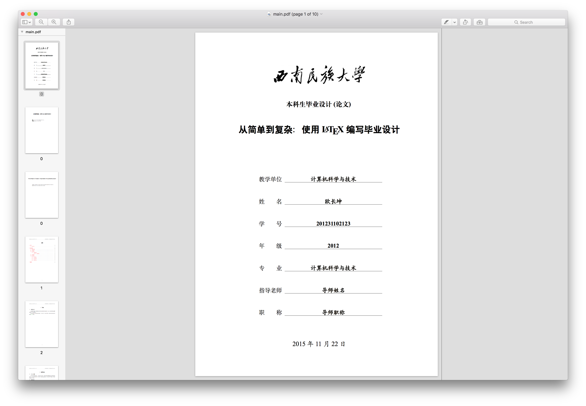
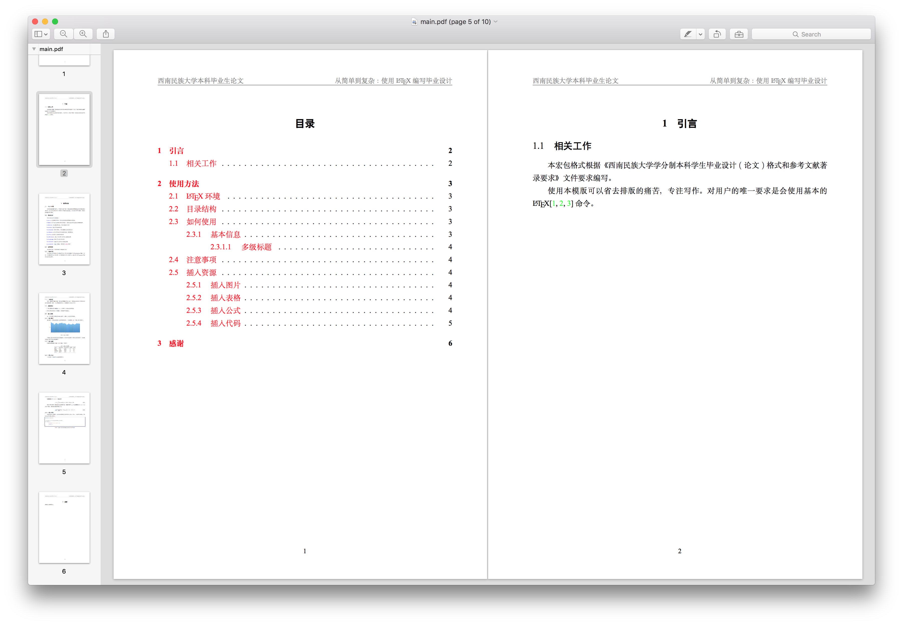
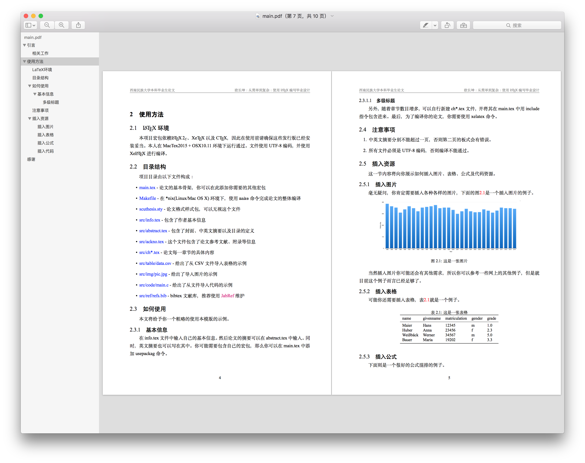
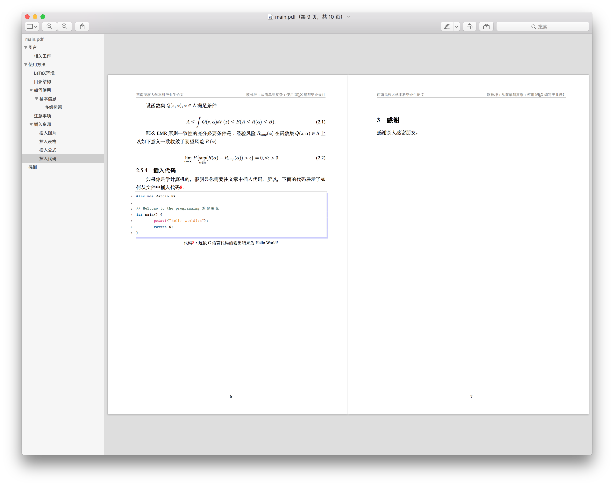

# 西南民族大学本科毕业设计论文模版
本项目给出了一个毕业设计论文的模板，可以忽略一些LaTeX的语法细节进行高效论文编写。

使用过程中若遇到任何问题，欢迎联系我：**[hi[at]changkun.us](mailto:hi@changkun.us)**。

# 注意事项
- 适用于西南民族大学学生
- 目前仅支持本科生毕业论文

# 板式效果

# 许可证
本项目依照 GNU LGPL 协议授权分发的自由软件, 在使用本项目时，您的可以：

- 任意下载本项目且无需支付任何费用
- 任意将本项目的副本分发给他人使用
- 获取和修改本项目的源代码

唯需遵守以下条件:
- 当您将自己对本项目的修改版(即衍生作品)发布时，衍生作品也必须按照GNU LGPL或更严格的协议发布

**特别声明** 由于 LaTeX 文档的特殊性，使用此宏包构建的文档（即学位论文）不属于 LGPL 协议生效的一部分，即用户无需在文档中包含本宏包的版权声明和引用说明。如果你希望表示对本项目的支持，可以在学位论文末尾的感谢处保留对项目作者的支持和感谢。
